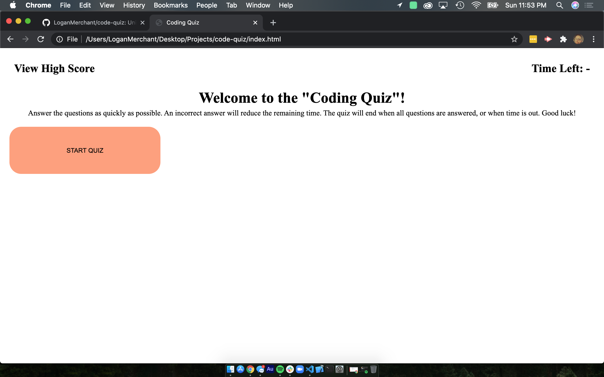
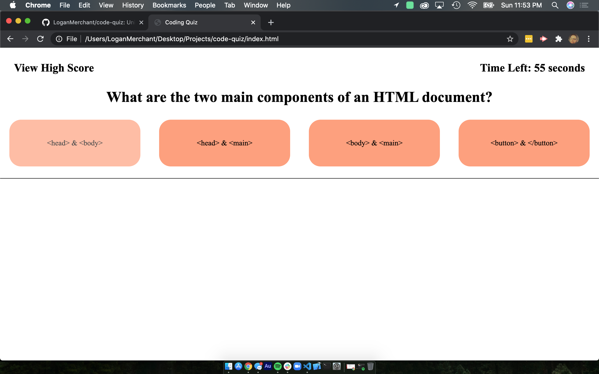
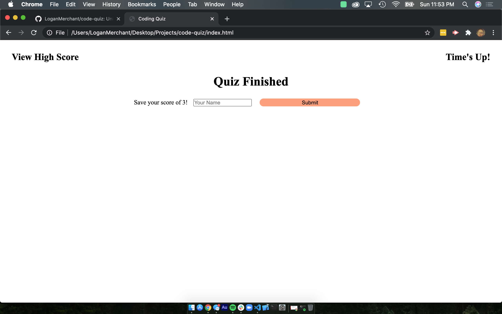

# Code Quiz

## Languages Used
* HTML
* CSS 
* Javascript

## Description
Provides users with a short quiz on HTML, CSS, and Javascript. They are given a series of questions and must try to answer them before the timer runs out. Once all questions are answered, or when the timer reaches 0, the user is told whether or not they beat the high score. If they did, they are given the opportunity to save their name and score to `localStorage`.

## Process
This challenge provided me with the most challenge to date. I began by trying to get the HTML set up, then the JS, then the CSS, but eventually began to run out of time and had to just do what I could with the time remaining. The code could certainly be cleaner, but I plan to revisit this project in the future, when time permits.

## Link to Deployed Application
[Coding Quiz!](https://loganmerchant.github.io/code-quiz/)

## Screenshots

